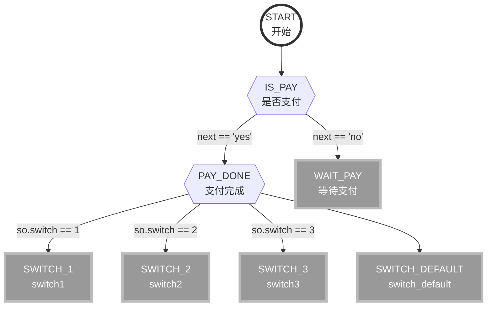

# veasion-flow

veasion-db 是一个轻量级流程框架，支持各种复杂业务以流程形式运转，对应动态节点功能实现。


流程示例：




从开始节点 START 依次往下执行，条件节点 判断流程下一个节点方向，上面每一个节点都有对应业务实例。

## springboog集成
```java

import cn.veasion.flow.FlowManager;
import cn.veasion.flow.core.IFlowLock;
import cn.veasion.flow.core.IFlowService;
import org.springframework.context.annotation.Bean;
import org.springframework.context.annotation.Configuration;

import java.util.concurrent.ExecutorService;
import java.util.concurrent.Executors;
import java.util.concurrent.LinkedBlockingQueue;
import java.util.concurrent.ThreadPoolExecutor;
import java.util.concurrent.TimeUnit;

@Configuration
public class FlowConfig {

    @Bean
    public FlowManager flowManager(IFlowService flowService, IFlowLock flowLock) {
        // 独立线程池
        int corePoolSize = Runtime.getRuntime().availableProcessors() * 2;
        // 链表无限制队列线程池
        ExecutorService executorService = new ThreadPoolExecutor(
                corePoolSize,
                corePoolSize,
                5,
                TimeUnit.SECONDS,
                new LinkedBlockingQueue<>(),
                Executors.defaultThreadFactory());
        return new FlowManager(flowService, flowLock, executorService, true);
    }

}
```
FlowLock
```java
import cn.veasion.flow.core.IFlowLock;
import org.springframework.dao.DataAccessException;
import org.springframework.data.redis.connection.RedisConnection;
import org.springframework.data.redis.core.RedisCallback;
import org.springframework.data.redis.core.RedisTemplate;
import org.springframework.stereotype.Component;

import javax.annotation.Resource;
import java.nio.charset.StandardCharsets;

/**
 * FlowLock
 */
@Component
public class FlowLock implements IFlowLock {

    @Resource
    private RedisTemplate<String, Object> redisTemplate;

    private long expireOfSecond = 180;

    @Override
    public boolean tryLock(String flow, String flowCode) {
        String key = key(flow, flowCode);
        Boolean result = redisTemplate.execute((RedisCallback<Boolean>) connection -> {
            byte[] bytes = key.getBytes(StandardCharsets.UTF_8);
            Boolean result1 = connection.setNX(bytes, new byte[]{1});
            if (result1 != null && result1) {
                connection.expire(bytes, expireOfSecond);
            }
            return result1;
        });
        return Boolean.TRUE.equals(result);
    }

    @Override
    public void unlock(String flow, String flowCode) {
        String key = key(flow, flowCode);
        redisTemplate.execute((RedisCallback<Long>) connection -> {
            byte[] bytes = key.getBytes(StandardCharsets.UTF_8);
            return connection.del(bytes);
        });
    }

    private String key(String flow, String flowCode) {
        return "flow_" + flow + "_" + flowCode;
    }

}

```

FlowService
```java
import cn.veasion.flow.FlowContext;
import cn.veasion.flow.IFlowNode;
import cn.veasion.flow.core.FlowException;
import cn.veasion.flow.core.IFlowService;
import cn.veasion.flow.model.FlowDefaultConfig;
import cn.veasion.flow.model.FlowNextConfig;
import cn.veasion.flow.model.FlowNodeConfig;
import cn.veasion.flow.model.FlowRun;
import cn.veasion.flow.model.FlowRunTrack;
import lombok.extern.slf4j.Slf4j;
import org.springframework.beans.factory.annotation.Autowired;
import org.springframework.jdbc.datasource.DataSourceTransactionManager;
import org.springframework.stereotype.Component;
import org.springframework.transaction.TransactionDefinition;
import org.springframework.transaction.TransactionStatus;
import org.springframework.transaction.interceptor.DefaultTransactionAttribute;
import org.springframework.transaction.support.DefaultTransactionDefinition;

import javax.annotation.Resource;
import java.util.HashMap;
import java.util.List;
import java.util.Map;

/**
 * MetaFlowService
 */
@Slf4j
@Component
public class FlowService implements IFlowService {

    private static boolean saveTrack = false;

    @Resource
    private DataSourceTransactionManager transactionManager;

    private Map<String, IFlowNode> flowNodeMap;

    @Autowired(required = false)
    public void init(List<IFlowNode> flowNodeList) {
        flowNodeMap = new HashMap<>();
        for (IFlowNode flowNode : flowNodeList) {
            if (flowNodeMap.containsKey(flowNode.getCode())) {
                throw new FlowException("流程节点 " + flowNode.getCode() + " 存在多个");
            } else {
                flowNodeMap.put(flowNode.getCode(), new ProxyFlowNode(flowNode, transactionManager));
            }
        }
    }

    @Override
    public List<FlowDefaultConfig> queryFlowDefaultConfig() {
        // TODO select * from flow_default_config where is_deleted = 0
    }

    @Override
    public List<FlowNextConfig> queryFlowNextConfig() {
        // TODO select * from flow_next_config where is_deleted = 0
    }

    @Override
    public List<FlowNodeConfig> queryFlowNodeConfig() {
        // TODO select * from flow_node_config where is_deleted = 0
    }

    @Override
    public FlowRun queryFlowRun(String flow, String flowCode) {
        // TODO select * from flow_run where is_deleted = 0 and flow = #{flow} and flow_code = #{flowCode}
    }

    @Override
    public List<FlowRunTrack> queryFlowRunTrack(String flow, String flowCode) {
        // TODO select * from flow_run_track where is_deleted = 0 and flow = #{flow} and flow_code = #{flowCode}
    }

    @Override
    public void saveFlowRun(FlowRun flowRun) {
        flowRun.setIsDeleted(0L);
        Long id = null;
        // TODO insert into flow_run
        flowRun.setId(id);
    }

    @Override
    public void updateFlowRun(FlowRun flowRun) {
        // TODO update flow_run
    }

    @Override
    public void saveFlowRunTrack(FlowRunTrack flowRunTrack) {
        if (saveTrack) {
            flowRunTrack.setIsDeleted(0L);
            Long id = null;
            // TODO insert into flow_run_track
            flowRunTrack.setId(id);
        }
    }

    @Override
    public IFlowNode getFlowNode(String code) {
        return flowNodeMap.get(code);
    }

    public static class ProxyFlowNode implements IFlowNode {

        private IFlowNode flowNode;
        private DataSourceTransactionManager transactionManager;

        public ProxyFlowNode(IFlowNode flowNode, DataSourceTransactionManager transactionManager) {
            this.flowNode = flowNode;
            this.transactionManager = transactionManager;
        }

        @Override
        public void onFlow(FlowContext context) throws Exception {
            if (log.isDebugEnabled()) {
                log.debug("开始执行流程 " + context.getFlowCode() + "，节点 " + getCode());
            }
            // 事务
            DefaultTransactionDefinition def = new DefaultTransactionAttribute();
            def.setPropagationBehavior(TransactionDefinition.PROPAGATION_REQUIRED);
            TransactionStatus transactionStatus = transactionManager.getTransaction(def);
            try {
                flowNode.onFlow(context);
                transactionManager.commit(transactionStatus);
            } catch (Exception e) {
                transactionManager.rollback(transactionStatus);
                context.putData("error", e.getClass().getName() + ": " + e.getMessage());
                log.error("执行流程 {}，节点 {} 失败", context.getFlowCode(), getCode(), e);
                throw e;
            }
            if (log.isDebugEnabled()) {
                log.debug("执行流程 " + context.getFlowCode() + "，节点 " + getCode() + " 结束");
            }
        }

        @Override
        public String getCode() {
            return flowNode.getCode();
        }
    }

    public static void setSaveTrack(boolean saveTrack) {
        FlowService.saveTrack = saveTrack;
    }

}
```