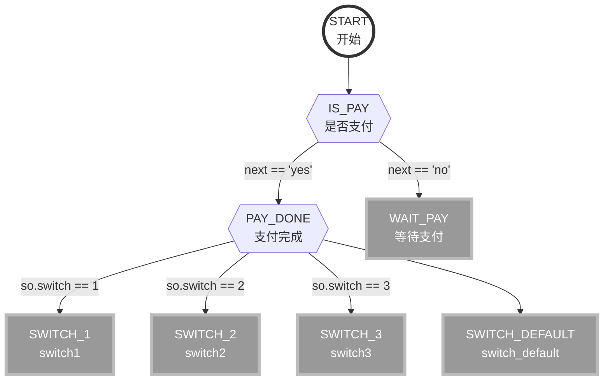

# veasion-flow

veasion-db 是一个轻量级流程框架，支持各种复杂业务以流程形式运转，对应动态节点功能实现。

流程示例：

```mermaid
graph TD
0((START<br/>开始))-->2{{IS_PAY<br/>是否支付}}
2-->|"next == 'yes'"| 6{{PAY_DONE<br/>支付完成}}
2-->|"next == 'no'"| SOWAIT_PAY[WAIT_PAY<br/>等待支付]
6-->|"so.switch == 1"| SOSWITCH_1[SWITCH_1<br/>switch1]
6-->|"so.switch == 2"| SOSWITCH_2[SWITCH_2<br/>switch2]
6-->|"so.switch == 3"| SOSWITCH_3[SWITCH_3<br/>switch3]
6-->SOSWITCH_DEFAULT[SWITCH_DEFAULT<br/>switch_default]
style 0 fill:#fff,stroke:#333,stroke-width:4px,color:#333
style SOWAIT_PAY fill:#999,stroke:#bbb,stroke-width:4px,color:#fff
style SOSWITCH_1 fill:#999,stroke:#bbb,stroke-width:4px,color:#fff
style SOSWITCH_2 fill:#999,stroke:#bbb,stroke-width:4px,color:#fff
style SOSWITCH_3 fill:#999,stroke:#bbb,stroke-width:4px,color:#fff
style SOSWITCH_DEFAULT fill:#999,stroke:#bbb,stroke-width:4px,color:#fff
```

从开始节点 START 依次往下执行，条件节点 判断流程下一个节点方向，上面每一个节点都有对应业务实例。

